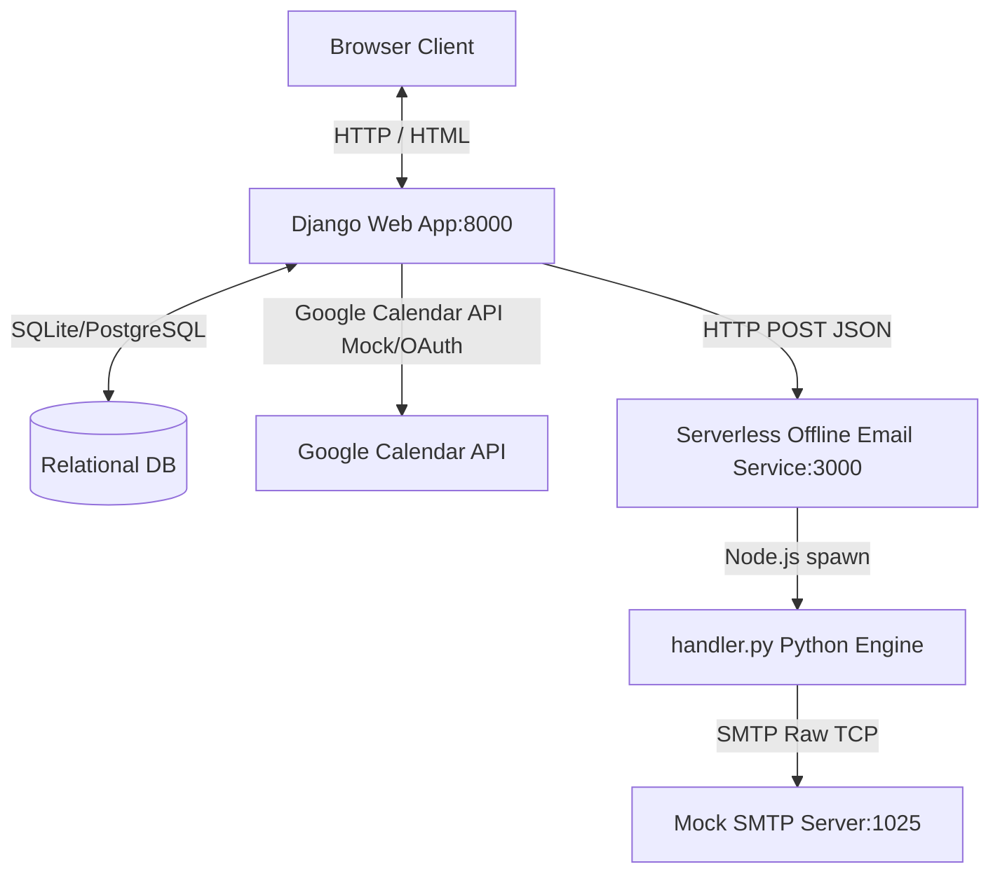

# HMS - Hospital Management System

## Setup and Run

Follow these step-by-step instructions to set up and run the entire Hospital Management System (HMS) stack on a fresh machine. This application comprises a Django backend, a Serverless Offline email microservice, a Mock SMTP server, and a Google Calendar API mock layer.

### 1. Prerequisites
Ensure you have the following installed on your host machine:
* **Python 3.10+** (includes `pip` and `venv`)
* **Node.js 18+** (includes `npm`)

---

### 2. Initial Repository Setup
Open your terminal (PowerShell on Windows, or Bash on macOS/Linux) and navigate to the project root directory:

```bash
cd c:\Users\Sonali Jha\Desktop\HMS
```

---

### 3. Setup the Python Virtual Environment
Initialize, activate, and configure the Python dependencies:

**On Windows (PowerShell):**
```powershell
# Create virtual environment if it does not exist
python -m venv venv

# Activate the virtual environment
.\venv\Scripts\Activate.ps1

# Install backend dependencies
pip install -r backend/requirements.txt
```

**On macOS / Linux:**
```bash
# Create virtual environment if it does not exist
python3 -m venv venv

# Activate the virtual environment
source venv/bin/activate

# Install backend dependencies
pip install -r backend/requirements.txt
```

---

### 4. Configure Database and Migrations
Initialize the local SQLite database and apply database migrations to prepare the database schema:

```bash
cd backend
python manage.py migrate
```

---

### 5. Launch the Services

To run the full stack, you will need to start three distinct processes. You should run these in separate terminal tabs or background jobs.

#### Process A: Mock SMTP Mail Server
This local server captures outgoing email TCP sockets on port 1025 and logs SMTP payloads locally for inspection without requiring real internet credentials.

**On Windows / macOS / Linux:**
```bash
# From the project root
.\venv\Scripts\python.exe email-service/mock_smtp.py
# (Or python3 if on macOS/Linux with environment activated)
```
*Expected console output: `[*] HMS Mock SMTP Server running locally on 127.0.0.1:1025...`*

#### Process B: Serverless Offline Email Microservice
This service runs a Serverless HTTP offline environment on port 3000, listening for microservice triggers and routing notifications via the Mock SMTP mail server.

**On Windows / macOS / Linux:**
```bash
cd email-service
npm install
npx serverless offline --host 127.0.0.1
```
*Expected console output: `Server ready: http://127.0.0.1:3000 🚀`*

#### Process C: Django Web Backend
This is the core MVC application hosting the doctors' and patients' portal.

**On Windows / macOS / Linux:**
```bash
cd backend
python manage.py runserver
```
*Expected console output: `Starting development server at http://127.0.0.1:8000/`*

---

### 6. Verify System Integrations (Automated Test Suite)
We have included a full end-to-end integration verifier that executes database concurrency locks, welcomes users, coordinates availability publishing, schedules a booking, syncs dummy Google accounts, and handles confirmation SMTP dispatches in one unified test.

To run it, make sure the SMTP and Serverless microservices are active in the background, then execute:

```bash
cd backend
python verify_hms.py
```

*Expected console output:*
```text
================================================================================
               HOSPITAL MANAGEMENT SYSTEM - INTEGRATION VERIFIER
================================================================================
[*] Cleaning up old test data...
    -> Clean complete.
[*] Creating Doctor User 'verify_doc'...
    -> Doctor user and Neurology profile saved.
[*] Triggering Welcome Email for Doctor via Serverless Offline...
[HMS EMAIL SERVICE] Notification triggered successfully: {'message': 'Email sent successfully!', ...}
[*] Creating Patient User 'verify_pat'...
    -> Patient user and date-of-birth profile saved.
[*] Triggering Welcome Email for Patient via Serverless Offline...
[HMS EMAIL SERVICE] Notification triggered successfully: {'message': 'Email sent successfully!', ...}
[*] Publishing Doctor Availability...
    -> Slot published successfully (ID: 9)
[*] Reserving slot (Simulating row locking transaction)...
    -> Slot locked & Booking created ID: 9
[*] Triggering Google Calendar event creations for both users...
[GOOGLE CALENDAR MOCK] Event created successfully on account...
[*] Triggering Booking Confirmation emails via Serverless Offline...
================================================================================
                 HMS INTEGRATION VERIFICATION COMPLETE!
================================================================================
```

Now open your web browser and navigate to **`http://127.0.0.1:8000/`** to interact with the full web interface!

---

## System Architecture

The HMS application utilizes a decoupled, modern multi-service architecture designed to maximize user response times and ensure structural integrity.



### 1. Connection: Django Web Application and Serverless Email Service
* **Trigger Mechanism:** When actions occur in Django (e.g. user signup, booking confirmation), the application executes `send_notification_email` asynchronously from the core database transactions.
* **HTTP Communication:** Django builds a JSON payload and makes an HTTP POST request using `requests` to the Serverless Offline endpoint `http://127.0.0.1:3000/dev/email/send`.
* **Microservice Execution:** The Serverless Node.js process (`handler.js`) receives the endpoint request, parses the event, and spawns a Python sub-process executing `handler.py`. The Python handler generates structured HTML/Plain-text email bodies matching standard doctor/patient signup and confirmation templates, then opens a socket to dispatch them to the local SMTP port (`1025`).

### 2. Data Model Decisions
We chose a relational layout mapping Django database entities to enforce strict structural checks:
* **CustomUser (`AbstractUser`):** Extends standard Django auth. Implements a `role` field restricted to `doctor` or `patient`, enabling distinct permissions and clean database mappings.
* **DoctorProfile / PatientProfile:** Configured in standard `OneToOneField` relations to `CustomUser`. Keeps clinical data (such as Specialization or DOB) decoupled from core security authentication models.
* **AvailabilitySlot:** References `CustomUser` (limit_choices_to doctor) with `start_time` and `end_time`. Implements a `unique_together` constraint to physically prevent the creation of overlapping identical slots by the same provider.
* **Booking:** Implements a `OneToOneField` relationship directly to an `AvailabilitySlot`. This guarantees that an availability slot can **never** have multiple booking mappings at the database engine level.
* **GoogleCredential:** Saves access tokens, client credentials, refresh scopes, and OAuth configurations linked to users for handling background calendars.

### 3. Role-Based Access Enforcement
* **Authentication Wrappers:** Custom python decorators `@doctor_required` and `@patient_required` inspect user models on request dispatch. If a user attempts to bypass restrictions, they are blocked, flashed with a Django Message warning, and redirected to their respective landing page.
* **View Segregation:** Central dispatcher `dashboard_view` evaluates `request.user.role` on successful authentication and securely routes users to role-specific layouts (`doctor_dashboard` / `patient_dashboard`).

### 4. Google Calendar Integration
* **OAuth Authorization Flow:** Users initiate Google OAuth, redirecting to Google's consent screen. Upon completion, the secure callback endpoint `oauth/callback/` exchanges the authorization code for an offline OAuth2 credential set, persisting details in `GoogleCredential`.
* **Synchronization Dispatcher:** When a patient books an appointment, Django reads the credentials of both the doctor and the patient. It triggers `sync_appointment_event`, making concurrent API calls to populate both users' calendars with corresponding detail payloads (including specific start/end datetimes and user summaries). Local environments toggle `MOCK_GOOGLE_CALENDAR=True` in `.env` to simulate a fully functional, lightning-fast offline mock of Google's responses without API limits.

---

## The Design Decision

### The Challenge: Handling Concurrency and Booking Race Conditions
In a high-demand healthcare application, a critical issue is when two patients simultaneously attempt to book the exact same `AvailabilitySlot` at the exact same millisecond. If not handled correctly, both database requests might find the slot available and create double-bookings, causing major operational friction.

### The Two Options Considered

#### Option A: Optimistic Concurrency Control (OCC)
In OCC, we would add an `updated_at` datetime or an integer `version` field to the `AvailabilitySlot` model. Upon booking, we would execute a database check:
```python
rows_updated = AvailabilitySlot.objects.filter(id=slot_id, version=original_version).update(is_booked=True, version=original_version + 1)
if not rows_updated:
    raise RaceConditionException("Slot already modified!")
```
* **Pros:** Highly scalable; does not lock database rows, maximizing write throughput in scenarios with few direct resource conflicts.
* **Cons:** Pushes conflict resolution logic into the application layer. If a write fails, the application must manage rollback state, clear subsequent network requests, or trigger auto-retries.

#### Option B: Pessimistic Row-Level Locking (Pessimistic Concurrency Control)
In Pessimistic Locking, we use database-level engine locks to block concurrent reads and writes on target rows:
```python
with transaction.atomic():
    slot = AvailabilitySlot.objects.select_for_update().get(id=slot_id)
    if slot.is_booked:
        raise BookingException("Already booked!")
    slot.is_booked = True
    slot.save()
```
* **Pros:** Guarantees absolute, ironclad consistency directly at the database engine level. Prevents race conditions entirely by queuing concurrent transaction reads.
* **Cons:** Locks the row for the duration of the transaction block, which can block database threads if the transaction is long or includes network I/O.

### Our Choice and Reasoning: Option B (Pessimistic Row-Level Locking)
We chose **Option B (Pessimistic Row-Level Locking)** using Django's `select_for_update()`.

In a medical booking system, **absolute transactional accuracy is a non-negotiable requirement**. Double-booking is a catastrophic failure that ruins patient trust. Pessimistic locking handles this robustly at the database tier before any data integrity is compromised.

To avoid the performance downsides of pessimistic locking (e.g. database thread starvation), we made a strict architectural rule: **All external API calls (Serverless email alerts, Google Calendar synchronization) are executed outside of the `transaction.atomic()` block.** 

The database transaction is kept incredibly tight:
1. Open atomic transaction.
2. Select availability slot and lock the row using `select_for_update()`.
3. Check status, set `is_booked = True`, write booking record.
4. Commit transaction and release database locks (takes < 5ms).
5. (Out of transaction) Trigger background integrations (Google Calendar, Serverless Email HTTP POST).

This provides the best of both worlds: complete protection against race conditions combined with lightning-fast database transaction releases.

---

## Limitations

### 1. Database Bottlenecks under Local SQLite
* **The Breakpoint:** While SQLite is excellent for zero-config offline development, it does not support real concurrent write operations. When multiple threads try to execute `select_for_update()`, SQLite locks the entire database file (`database is locked` error). In production, this would immediately crash the reservation flow under load.
* **The Fix:** Switch the environment fully to **PostgreSQL** (already coded as the primary engine in `settings.py` but currently falling back if a server is offline). PostgreSQL supports precise, native row-level blocking locks without locking unrelated tables or the database file.

### 2. Synchronous External Network Calls in HTTP Thread Pool
* **The Breakpoint:** Although we successfully placed external calls (Google Calendar sync, Serverless POST requests) outside of the database transaction block, these calls are still executed **synchronously within Django's core web server thread**. If the Google Calendar API or the Serverless endpoint takes 3–5 seconds to respond due to transient network congestion, that specific Django worker thread is blocked. Under heavy traffic, all available worker threads would quickly saturate, causing incoming web requests to timeout.
* **The Fix:** Implement an asynchronous task worker queue using **Celery with Redis** as a message broker. When an appointment is booked, Django should immediately commit the database change and queue a background task:
  ```python
  sync_calendar_and_notify_task.delay(booking.id)
  ```
  The Django view can then instantly return a `200 OK` response to the user's browser in under 50ms, while background workers handle network retries, exponential backoffs, and external API rate limit constraints.

### 3. Lack of Security on the Serverless Offline Email Endpoint
* **The Breakpoint:** Currently, `http://127.0.0.1:3000/dev/email/send` does not validate the source of the requests. In a production cloud environment, anyone who discovers this endpoint could make unauthorized HTTP requests, sending malicious email notifications on behalf of the hospital.
* **The Fix:** Enforce security constraints by setting up AWS API Gateway with custom **API Keys** or **IAM Role Authorizations**. Django would pass an encrypted authentication header containing a rotating security token to authorize the request:
  ```python
  headers = {"x-api-key": os.getenv("EMAIL_SERVICE_API_KEY")}
  ```
